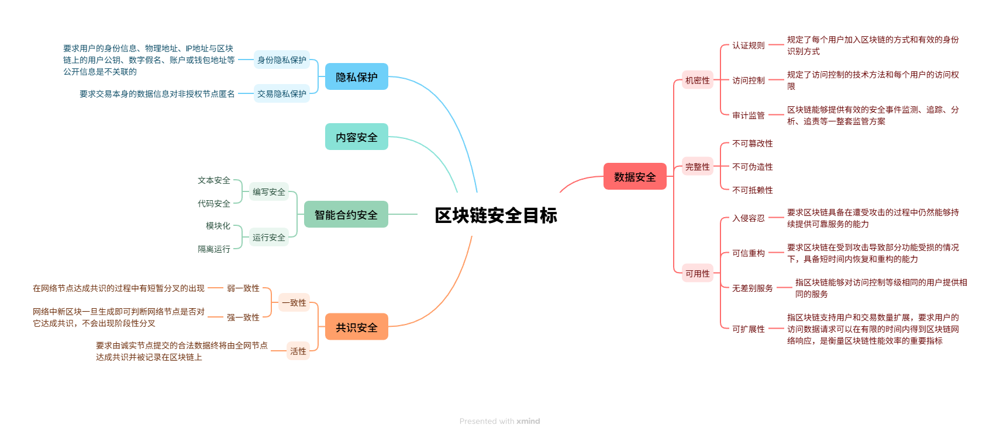
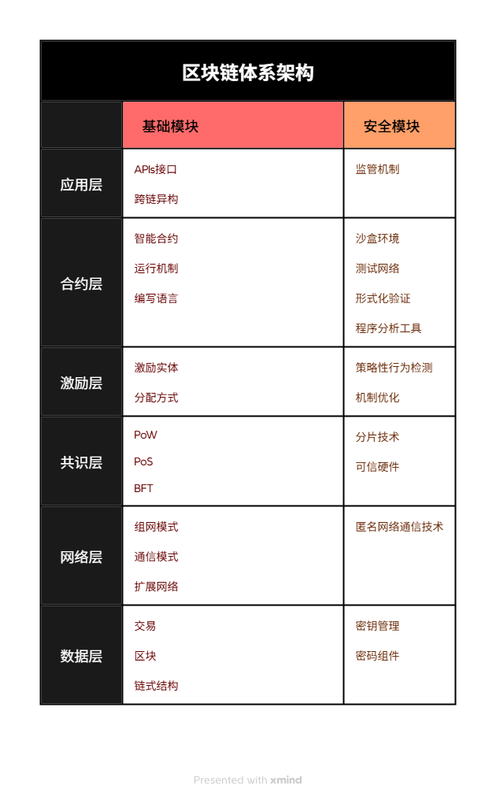
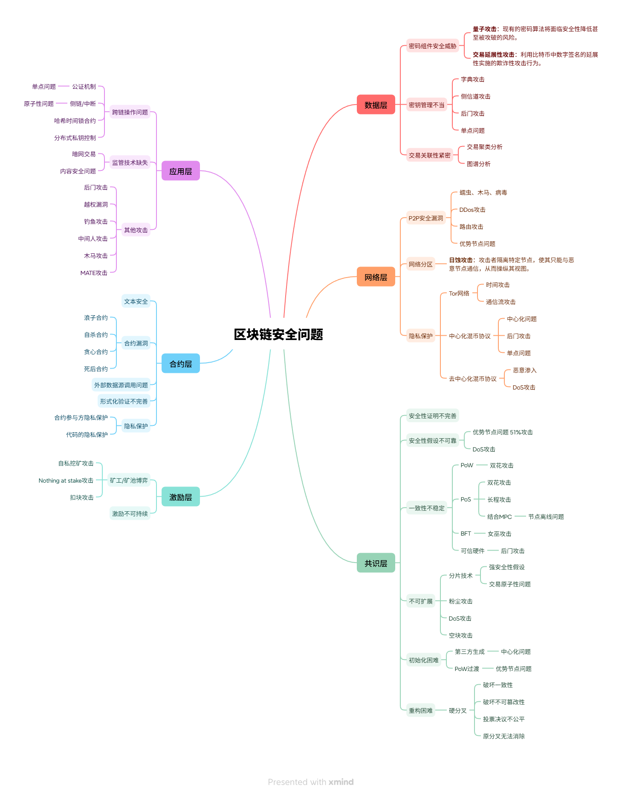
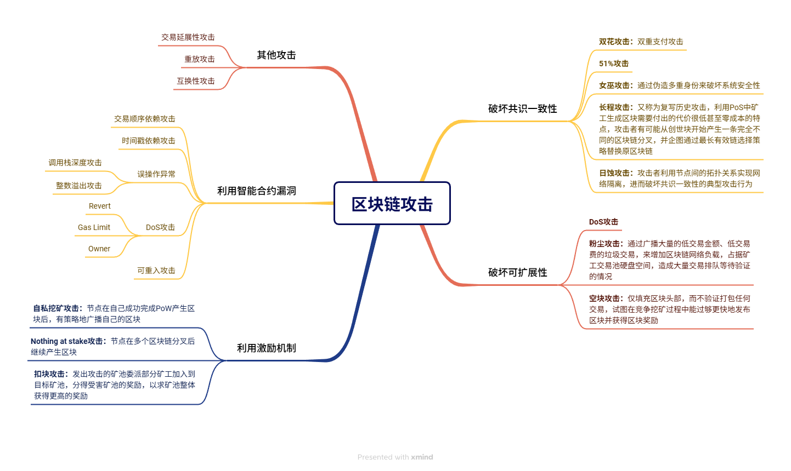

# 区块链安全与隐私保护

## 区块链的安全目标

## 区块链体系架构

## 区块链安全问题

## 区块链攻击

## 安全与隐私保护技术

### 盲签名
盲签名是一种数字签名技术，允许签名者在不知道消息内容的情况下对消息进行签名。常用于匿名支付系统中，如比特币的隐私增强。

### 群签名
群签名允许群组中的成员匿名签署消息，同时保留群组管理员验证签名的能力。适用于需要匿名性和可追溯性的场景。

### 环签名
环签名是一种多方签名形式，签名者可以选择一组可能的签名者（包括自己），使得签名无法确定具体由谁签署。提供匿名性而不需可信第三方。

### 零知识证明
零知识证明允许一方证明某个陈述的真实性，而不透露任何额外信息。用于隐私保护，如证明账户余额而不暴露具体金额。

### 同态加密
同态加密允许对加密数据进行计算，计算结果解密后与明文计算结果相同。支持在不解密数据的情况下进行运算，保护隐私。

### 安全多方计算
安全多方计算允许多方在不透露各自输入的情况下共同计算函数结果。用于分布式隐私保护计算。

### 混币技术
混币技术通过混淆交易来源和目的地来增强隐私。用户可以将资金发送到混币服务，服务重新分配资金，使追踪变得困难。

### TOR网络
TOR（The Onion Router）是一种匿名网络，通过多层加密和路由隐藏用户的IP地址和位置。区块链应用中用于增强节点匿名性。

## 典型的加密货币案例

### 零币-Zcash
Zcash使用零知识证明技术实现完全隐私保护的交易。用户可以选择公开或隐藏交易细节，支持可选隐私。

### 门罗币
Monero采用环签名和隐形地址等技术，提供强隐私保护。交易金额和参与者身份均被隐藏，难以追踪。

## 未来区块链安全方面研究重点

### 打破“不可能三角”
研究如何在区块链的三要素（去中心化、安全性、可扩展性）中取得平衡，探索新型共识机制和分层架构。

### 隐私保护与可控监管
开发既保护用户隐私又允许监管机构在必要时访问信息的机制，如可监管隐私技术。

### 区块链互联
研究不同区块链之间的互操作性，确保安全跨链通信和资产转移。

### 系统及安全体系
构建全面的区块链安全框架，包括威胁建模、风险评估和应急响应机制。